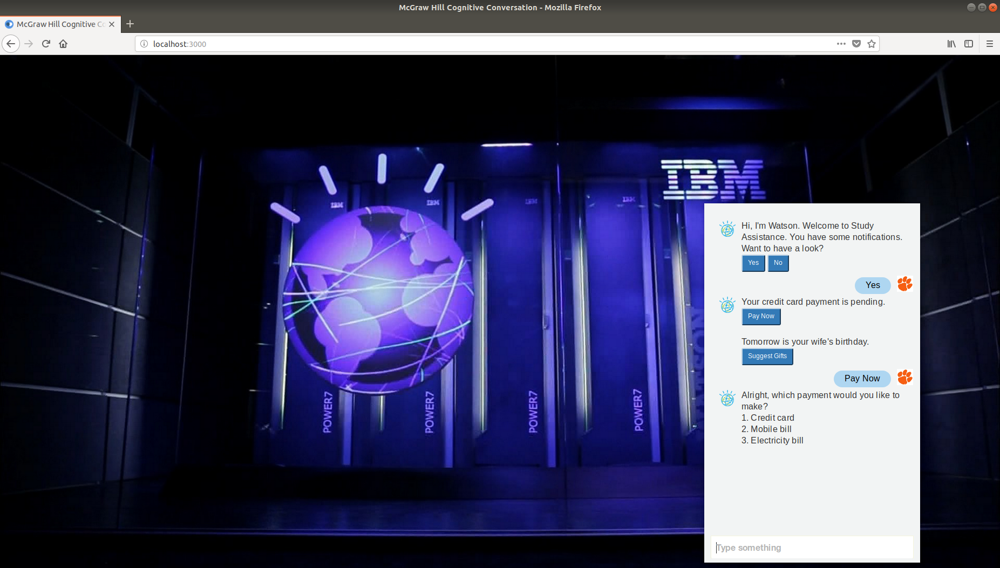

# McGraw-Hill Study Assistant

This repository showcases a prototype chatbot assistant. The chatbot runs in a browser and responds to queries. To run this repository on your local machine perform the following:

1) clone the repository to your Ubuntu machine using `git clone https://github.com/efwoods/McGraw-Hill`
2) Move into the repository with `cd McGraw-Hill`
3) run `npm install`
4) start the server with `npm start`
5) open a browser and type `localhost:3000` in the URL to navigate to the chatbot window
6) chat with the bot!

The dialogue with the bot can be updated using the Watson Assistant and Watson Discovery Tooling. The conversation is currently focused on banking assitance, and will be updated in the future.
